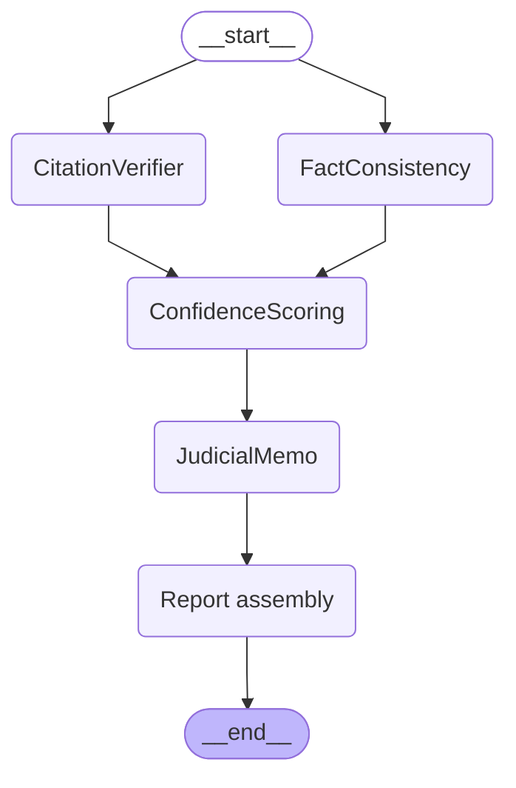

# BS Detector

Multi-agent legal verification pipeline that audits a Motion for Summary
Judgment against its supporting record (police report, medical records,
witness statement) and the legal authorities it cites.

> The challenge brief lives in [CHALLENGE.md](CHALLENGE.md).
> Design notes and tradeoffs live in [REFLECTION.md](REFLECTION.md).

## Quick start

```bash
make setup        # uv venv + deps + .env + npm install
echo OPENAI_API_KEY=sk-... >> backend/.env
make dev          # backend on :8002, frontend on :5175
```

Open `http://localhost:5175`, click **Run analysis**.

## Architecture

A LangGraph `StateGraph` orchestrates four named agents over a typed state.
`CitationVerifier` and `FactConsistency` operate on disjoint inputs (legal
authorities vs supporting documents) and run in parallel via fan-out from
`START`. `score`, `memo`, and `assemble` form the sequential tail because
each consumes the previous step's output.



Regenerate the raw mermaid output any time with:

```bash
make graph
```

### Agents

Each agent lives in its own subpackage under `backend/agents/`, with an
explicit `prompt.py`, `schema.py` (when LLM-backed), and `agent.py`:

| Agent | Type | Responsibility |
|---|---|---|
| `CitationVerifier` | LLM (tool-call) | Extracts every citation, proposition, and direct quote. Sets `support_decision` and `quote_decision` per citation. |
| `FactConsistency` | LLM (tool-call) + 3 deterministic safeguards | Compares motion claims to supporting docs. Emits one `Finding` per claim. Safeguards: missing-quote downgrade, salient-token grounding gate (blocks both false `accepted` and false `rejected`), salient-token dedupe. |
| `ConfidenceScoring` | Deterministic | Normalizes confidence and produces a coherent `confidence_reason`. `could_not_verify` capped at 0.5; grounded contradictions/supports floored at 0.8; ungrounded ones capped at 0.4. |
| `JudicialMemo` | LLM (free text) | Writes a short paragraph for a judge from the ranked findings. Wrapped in try/except in its node so its failure never takes the report down. |

### Decisions, not severity

The public report uses a 3-state decision model end to end:

- `accepted` — the record supports the claim.
- `rejected` — the record contradicts the claim, with a verbatim
  evidence quote located in the named source document.
- `unable_to_determine` — the cited authority is missing, the supporting
  record is silent, or evidence is ambiguous. This is the explicit way the
  pipeline says "I don't know" instead of fabricating a finding.

Citation verification results live in `report.citation_review.citations[]`,
not in `report.checks[]`, so missing legal authorities never produce noisy
"could_not_verify" check rows.

## API

```
POST /analyze
```

Loads the documents in `backend/documents/`, runs the pipeline, and returns:

```json
{
  "report": {
    "case_name": "Rivera v. Harmon Construction Group, Inc.",
    "overall_decision": "rejected",
    "summary": "Overall: rejected. 8 factual check(s) — 3 rejected, ...",
    "citation_review": {
      "decision": "unable_to_determine",
      "total_citations": 12,
      "reason": "...",
      "citations": [
        {
          "citation_id": "...",
          "raw_citation": "Privette v. Superior Court, 5 Cal.4th 689, 702 (1993)",
          "proposition": "A hirer is never liable...",
          "direct_quote": "A hirer is never liable...",
          "support_decision": "unable_to_determine",
          "support_reason": "The cited authority text was not available...",
          "quote_decision": "unable_to_determine",
          "quote_reason": "The quoted authority text was not available..."
        }
      ]
    },
    "checks": [
      {
        "check_id": "...",
        "category": "fact",
        "statement": "Rivera was not wearing required PPE...",
        "decision": "rejected",
        "reason": "Police report and witness statement indicate Rivera was wearing a harness...",
        "source_document": "police_report.txt",
        "evidence_quote": "Site supervisor Mark Ellison confirmed...",
        "confidence": 0.8,
        "confidence_reason": "Evidence quote located verbatim in source document."
      }
    ],
    "judicial_memo": "The motion is undermined by ...",
    "metrics": { "total_citations": 12, "total_checks": 8, ... },
    "errors": []
  }
}
```

## Eval harness

```bash
make eval
# or:
cd backend && ./.venv/bin/python evals/run_evals.py
```

Runs the live pipeline once, scores the result against
`backend/evals/golden_findings.json`, prints a readable report, and saves:

- `backend/evals/baseline_results.json` — last run.
- `backend/evals/runs/<timestamp>.json` — append-only history.

### Metrics

| Metric | Definition |
|---|---|
| `schema_validity` | 1.0 if `VerificationReport` validates, else 0.0 |
| `precision` | `correct_rejected / generated_rejected`. Only `rejected` checks are scored. |
| `recall` | `matched_expected_rejected / expected_rejected`. Only `rejected` expectations are scored. |
| `hallucination_rate` | Of `rejected` checks, fraction missing `source_document`, missing `evidence_quote`, or with a quote not found verbatim in any source. `unable_to_determine` is **not** counted. |
| `unable_to_determine_rate` | `unable_to_determine_checks / total_checks` |
| `coverage` | `(accepted + rejected) / total_checks` — share of decided (non-uncertain) checks |

### Current baseline

`make eval` against the Rivera case file:

```
schema_validity = 1.00
precision       = 0.67
recall          = 0.67
hallucination_rate       = 0.00
unable_to_determine_rate = 0.62
coverage                 = 0.38
```

The golden fixture (`backend/evals/golden_findings.json`) is small and
synthetic — see its `limitations` field. It is meant to demonstrate the
harness, not to act as production legal ground truth.

## Project layout

```
backend/
├── main.py                    # FastAPI app + load_documents()
├── pipeline.py                # LangGraph StateGraph + report assembly
├── schemas.py                 # Pydantic models (public + internal)
├── llm.py                     # call_llm + call_with_tool (forced tool calling)
├── utils.py                   # to_case_documents, stable_id, normalize, quote_grounded_in
├── print_graph.py             # `make graph` — mermaid dump
├── agents/
│   ├── citation_verifier/     # prompt.py + schema.py + agent.py
│   ├── fact_consistency/      # prompt.py + schema.py + agent.py
│   ├── confidence_scorer/     # agent.py (deterministic)
│   └── judicial_memo/         # prompt.py + agent.py
├── documents/                 # the case file
└── evals/
    ├── run_evals.py
    ├── golden_findings.json
    ├── baseline_results.json
    └── runs/

frontend/
└── src/
    ├── App.jsx + App.css
    └── components/            # DecisionBadge, CitationReview, CheckCard,
                               # JudicialMemo, MetricsGrid, ErrorList
```

## Make targets

| Target | Purpose |
|---|---|
| `make setup` | uv venv, install deps, copy `.env.example`, `npm install` |
| `make dev` | Run backend + frontend in parallel |
| `make dev-backend` | Backend only (`uvicorn` on :8002) |
| `make dev-frontend` | Frontend only (`vite` on :5175) |
| `make eval` | Run the eval harness, persist results |
| `make graph` | Print the LangGraph as Mermaid |
